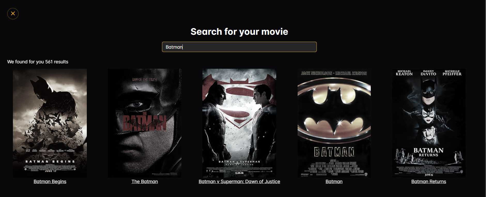
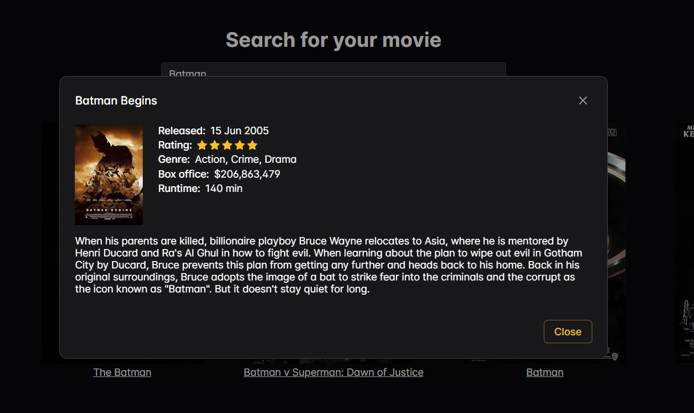

# vue-moviesearcher

Moviesearcher is an app that allows you to search for information about films. It uses OMDb API - The Open Movie Database to get all the information about film you search for.
## Home view


## Movie list view


## Movie card view


# Tech Stack

Project is build on Vue.js framework with the Option Api approach. For better design I used PrimeVue - UI Component Library and Primeflex as a support for CSS. State of the app is managed by Pinia library.

## Project Setup

```sh
npm install
```

## Compile and Hot-Reload for Development

```sh
npm run dev
```
